# アーキテクチャ設計書

## 設計パターン

- オブジェクト指向で作成する
- ECSは使わない
- 継承は階層は１段まで
- シンプルな設計を目標にする
- エラーハンドリングはPrint関数またはConsole関数を使用し、例外は使用しない

## 基本的なクラス、データ構造体の列挙

### 基盤系

#### GameManager

- ゲーム全体を管理して、ゲームプレイ中は常駐する
- Phaseのスマートポインタを持つ

#### PhaseManager

- フェーズの管理と切り替えを行う静的クラス
- 循環includeを避けるため、各Phaseの生成処理は外部から登録する方式（ファクトリパターン）を採用
- 現在のフェーズの更新と描画を制御する
- PhaseType毎の生成関数を保持し、フェーズ切り替え時に動的に生成する

#### DebugSystem

- デバッグ表示を行う静的ユーティリティクラス
- F10キーで表示/非表示を切り替え
- FPS、マウス座標、現在のフェーズ名、日付、精神力を画面左下に表示
- デバッグ用のボタン（暗転解除、次フェーズへ、日付/精神力操作、フェーズ選択）を提供
- リリースビルドでは無効化される想定

#### GameCommonData

- ゲーム進行中ずっと保持するデータを管理する構造体
  - 精神力
  - 残り日数
- モノステートでどこからでもアクセスできる

#### CommonUI

- GameCommonDataの要素を描画するクラス
- モノステートでどこからでもアクセスできる

#### MessageWindowUI

- メッセージウィンドウの描画、管理をするクラス
- モノステートでどこからでもアクセスできる

#### BlackOutUI

- 暗転処理と暗転時に表示するメッセージを管理するクラス
- モノステートでどこからでもアクセスできる

#### LlmChatWindow

- LLMを使用したチャットウィンドウを管理するクラス
- 妹とのLine風のチャットでやり取りを描画、管理する
- LLM周りとのやり取りも行う
- ChatMessageWindowを使ったメッセージ履歴の表示
- テキスト入力エリアと送信ボタンの管理

#### LlmChatWindowSetting

- LlmChatWindowの設定パラメータを保持する構造体
- UI関連とLLMの初期プロンプトを管理

#### LlmChatWindowDesc

- LlmChatWindowの構築に必要なパラメータをまとめた記述子構造体
- ChatMessageWindowの設定とLLM関連設定を統合

#### LlmChatTestUI

- LlmChatWindowを使用したテスト用UIクラス
- 開発中のデバッグ・検証用

#### SisterMessageUI

- LlmChatWindowをラップし、妹とのLINE風チャットUIを提供するクラス
- SisterMessageUIManagerがshared_ptrで所有し、各フェーズはweak_ptrで参照する
- SisterMessageUIManagerから初期化済みLLMモデルを取得
- 妹を演じさせるシステムプロンプトを設定
- LLMとの連携はLlmChatWindowに委譲

#### SisterMessageUIManager

- SisterMessageUIのインスタンスを所有・管理するクラス
- SisterMessageUI用の初期化済みLLMモデルを管理・提供する
- モノステート(static)でどこからでもアクセスできる
- Initialize()でSisterMessageUIを生成
- GetSisterMessageUI()でweak_ptrを提供
- Update()とDraw()でSisterMessageUIの更新・描画を行う

#### MouseEffectManager

- マウスの演出を管理する
- クリック時にクリック位置を示す、広がる輪のエフェクトを描画
- クリック時にクリックのSEを鳴らす
- モノステート
 
#### BackGroundManager

- 背景画像の読み込み、保持、描画を行うモノステートクラス
- `Initialize()` で `Asset/` 配下に定義された背景アセットをロードし、`Draw()` で現在の背景を画面全体に描画する
- フェーズや `GameManager` から `SetBackGround(id)` を呼び出して背景の切り替えを行う

### 導入フェーズ

#### IntroductionPhase

### 一日の始まりフェーズ

#### SunrisePhase

### 求職活動フェーズ

#### JobSearchPhase

- 実装ではフェーズ開始時にローカルLLMのテキストジェネレータを初期化するユーティリティ（CreateLlamaTextGenerator）を持ち、`ContextConfig`/`SamplingConfig` を設定してモデルを最適化している。

#### PasswordInputUI

- パスワード入力演出用のUI
- 操作はできない

#### ResumeUI

- 履歴書UIの動作を管理するクラス

#### RejectionInfo

- 採用したかどうか、企業名、お祈りメッセージをもつデータ構造体

#### RejectionListUI

- 不採用リストUIの動作を管理するクラス

#### LoadingUI

- ロード中ダイアログUIの動作を管理するクラス

#### ServerLoadingUI

- 国民統合情報サーバーとの通信中を示すローディングダイアログUIクラス
- 回転するアイコンとメッセージを表示する
- RotatingIconを利用して回転アイコンを表示
- ResumeUIのオートコンプリート中にも使用される

#### RotatingIcon

- 回転するローディングアイコンを担当するユーティリティクラス
- テクスチャの読み込み、回転・スケール変調、描画までをカプセル化
- 回転速度、変調、スケール変化を設定可能
- LoadingUIとServerLoadingUIで使用される

### 妹メッセージフェーズ

#### SisterMessagePhase

### アルバイトフェーズ

#### WorkPhase

#### MachineParts

- 工場で流れてくる部品の描画、動作を管理するクラス
- HexBoltのインスタンスの配列をメンバに持つ

#### HexBolt

- 六角ボルトの描画と管理
- クリック時を感知してMachinePartsに報告する

### 一日の終わりフェーズ

#### SunsetPhase

### 夜の夢フェーズ

#### NightDreamPhase

### ゲームクリアフェーズ

#### GameClearPhase

### ゲームオーバーフェーズ

#### GameOverPhase

### バッドエンドフェーズ

#### BadEndPhase

### ユーティリティ

#### TweenUtil

- ツウィーン系の静的メソッドを大量に定義

#### SoundManager

- このゲームで使うサウンドをすべて管理する
- PlayBGM,PlaySE関数にサウンドアセットのキーとなる文字列を渡すと再生できる。
- PlayBGMはすでにBGMがかかっていた場合、クロスフェードで新しいBGMをかける
- StopBGM関数でStopできる。
- モノステートでどこからでもアクセスできる

#### FontManager

- このゲームで使うフォントをすべて管理する
- キーとなる文字列を渡すことで対応したフォントが返される
- 初期化時に定数のフォントアセットのパスを読み込んでまとめておく
- モノステートでどこからでもアクセスできる

#### UiConst

- UIで共通利用する色・角丸・枠線太さ・アイコンパスなどの定数をまとめた静的ユーティリティ
- 全てのUIコンポーネントが参照し、見た目の一元管理に利用する

#### GameConst

- 画面サイズ、プレイエリア、初期フェーズ、LLMモデルID 等のグローバル定数を保持するヘッダオンリーの静的定義
- レイアウトや各フェーズで必要となる定数を集中管理する

#### PhaseType

- フェーズを列挙する `enum class PhaseType` と、列挙値→文字列変換ユーティリティを提供する
- フェーズ遷移やデバッグ表示に使用される

#### iPhase

- フェーズ実装が従うための簡易インターフェース（`update()` / `draw()`）
- `GameManager` がフェーズを統一的に扱うための契約を提供する

#### ConfirmDialog

- 汎用の「はい/いいえ」確認ダイアログ。メッセージ表示、ボタン描画、クリック判定を行う軽量 UI コンポーネント
- `ResumeUI` 等の確認用途で利用される

#### LlmUtil

- LLM関連のユーティリティクラス
- LLMモデルの初期化と管理を担当する

## 各クラスの留意点

- Phase系クラスはiPhaseインターフェースを実装する
- PhaseManagerはファクトリパターンを使用してフェーズの生成を行う
- 循環includeを避けるため、各Phaseの生成処理はGameManagerから登録する
- SisterMessageUIのインスタンスはSisterMessageUIManagerが所有・管理する
- 各フェーズはSisterMessageUIManagerからweak_ptrを取得してSisterMessageUIにアクセスする
- DebugSystemはデバッグビルド時のみ有効化される

## クラス図

```mermaid
classDiagram
    %% 基盤系クラス
    class GameManager {
        -SceneManager~String~ sceneManager_
        +Update() void
        +Draw() void
        +ChangePhase(newPhase) void
        +GetCurrentPhase() String
    }

    class PhaseManager {
        <<monostate>>
        -static inline shared_ptr~iPhase~ currentPhase_
        -static inline PhaseType currentPhaseType_
        -static inline HashTable~PhaseType,PhaseFactory~ phaseFactories_
        +static Initialize() void
        +static RegisterPhaseFactory(phaseType, factory) void
        +static Update() void
        +static Draw() void
        +static PostDraw() void
        +static ChangePhase(phaseType) void
        +static GetCurrentPhaseType() PhaseType
        +static GetCurrentPhaseName() String
        +static GetNextPhaseType() PhaseType
    }

    class DebugSystem {
        <<monostate>>
        -static inline bool s_enabled
        -static inline int s_fps
        -static inline Vec2 s_mousePos
        -static inline size_t s_selectedPhaseIndex
        +static Update() void
        +static Draw() void
    }

    class GameCommonData {
        <<monostate>>
        -static inline int32 mentalPower_
        -static inline int32 currentDay_
        +static Initialize() void
        +static ChangeMentalPower(delta) void
        +static AdvanceDay() void
        +static GetMentalPower() int32
        +static GetRemainingDays() int32
        +static GetCurrentDay() int32
        +static IsMentalPowerZero() bool
        +static IsFinalDay() bool
        +static IsBeforeFinalDay() bool
        +static IsFirstDay() bool
        +static GetCurrentDateString() String
    }

    class CommonUI {
        <<monostate>>
        -static Font font_
        +static Initialize() void
        +static Draw() void
    }

    class MessageWindowUI {
        <<monostate>>
        -static Array~String~ messages_
        -static int32 currentIndex_
        -static bool isVisible_
        -static Font font_
        -static int32 currentCharIndex_
        -static Stopwatch charTimer_
        +static Initialize() void
        +static Show(messages) void
        +static Hide() void
        +static Next() bool
        +static Update() void
        +static Draw() void
        +static IsVisible() bool
        +static IsCompleted() bool
    }

    class BlackOutUI {
        <<monostate>>
        -static String message_
        -static double fadeAlpha_
        -static State state_
        -static double fadeDuration_
        -static Stopwatch fadeTimer_
        -static Font font_
        +static Initialize() void
        +static FadeIn(duration) void
        +static FadeOut(duration) void
        +static SetMessage(message) void
        +static ClearMessage() void
        +static ShowImmediately() void
        +static HideImmediately() void
        +static Update() void
        +static Draw() void
        +static IsFading() bool
        +static IsVisible() bool
        +static IsHidden() bool
        +static GetAlpha() double
    }

    class BackGroundManager {
        <<monostate>>
        -static HashTable~String,Texture~ backgrounds_
        -static String currentBackgroundId_
        +static Initialize() void
        +static SetBackGround(id) void
        +static Draw() void
    }

    class SisterMessageUIManager {
        <<monostate>>
        -static inline shared_ptr~SisterMessageUI~ sisterMessageUI_
        +static Initialize() void
        +static Update() void
        +static Draw() void
        +static GetSisterMessageUI() weak_ptr~SisterMessageUI~
    }

    class SisterMessageUI {
        -unique_ptr~LlmChatWindow~ llmChatWindow_
        -bool isActive_
        -bool isMessageSent_
        +Initialize(model) bool
        +Update() void
        +Draw() void
        +SetActive(active) void
        +SetInputAreaDisabled(disabled) void
        +IsActive() bool
        +Clear() void
        +AddSisterMessage(message, play_se) void
        +IsMessageReceived() bool
    }

    class LlmChatWindowSetting {
        +double input_area_height
        +StringView system_prompt
        +int max_input_char
    }

    class LlmChatWindowDesc {
        +ChatMessageWindowDesc chat_window_desc
        +LlmChatWindowSetting setting
    }

    class LlmChatWindow {
        -LlamaTextBuffer m_chat_message_buffer
        -shared_ptr~LlamaTextGenerator~ m_chat_message_generator
        -LlmChatWindowSetting m_setting
        -ChatMessageWindow m_chat_window
        -TextEditState m_input_area
        -bool m_input_area_disabled
        -function~void(StringView)~ m_on_message_receive
        -function~void(StringView)~ m_on_message_sent
        -bool m_is_waiting_response
        +Initialize(model) bool
        +Update() void
        +SetOnMessageReceived(on_message_receive) void
        +SetOnMessageSent(on_message_sent) void
        +Clear() void
        +ClearInputArea() void
        +AddMessage(text, sender) void
        +IsWaitingForReply() bool
        +SetInputAreaDisabled(bool) void
        -initializeChatMessageGenerator(model, system_prompt) shared_ptr~LlamaTextGenerator~
        -startResponse(request) void
        -onResponseComplete(text) void
    }

    class LlmChatTestUI {
        -unique_ptr~LlmChatWindow~ chat_ui_
        -unique_ptr~LlmScoreCalculator~ score_calculator_
        +Initialize(shared_model) bool
        +Update() void
    }

    class MouseEffectManager {
        <<monostate>>
        +static Initialize() void
        +static Update() void
        +static Draw() void
    }

    %% Phase基底クラス
    class iPhase {
        <<interface>>
        +update() void
        +draw() void
    }

    %% Phase実装クラス群
    class IntroductionPhase {
        -Array~String~ texts_
        +update() void
        +draw() void
    }

    class SunrisePhase {
        +update() void
        +draw() void
    }

    class JobSearchPhase {
        -PasswordInputUI passwordInputUI_
        -ResumeUI resumeUI_
        -LoadingUI loadingUI_
        -ServerLoadingUI serverLoadingUI_
        -RejectionListUI rejectionListUI_
        -unique_ptr~LlamaTextGenerator~ llmGenerator_
        -String selfPRText_
        -int32 evaluationScore_
        -PhaseState currentState_
        +update() void
        +draw() void
    }

    class SisterMessagePhase {
        -weak_ptr~SisterMessageUI~ sisterMessageUI_
        -bool isWorkDay_
        +update() void
        +draw() void
    }

    class WorkPhase {
        -Optional~MachineParts~ currentParts_
        -int32 completedCount_
        -bool showingInstruction_
        -BasicCamera3D camera_
        -DirectionalLight sunLight_
        +update() void
        +draw() void
    }

    class SunsetPhase {
        +update() void
        +draw() void
    }

    class NightDreamPhase {
        +update() void
        +draw() void
    }

    class GameClearPhase {
        +update() void
        +draw() void
    }

    class GameOverPhase {
        +update() void
        +draw() void
    }

    class BadEndPhase {
        -weak_ptr~SisterMessageUI~ sisterMessageUI_
        +update() void
        +draw() void
    }

    %% UI系クラス
    class PasswordInputUI {
        -String displayPassword_
        -Timer inputTimer_
        -Timer stateTimer_
        -Timer waitTimer_
        -size_t currentCharIndex_
        -State currentState_
        -Texture iconTexture_
        +Show() void
        +Update() void
        +Draw() void
        +IsCompleted() bool
        +GetState() State
    }

    class ResumeUI {
        -mutable TextAreaEditState selfPREditState_
        -mutable String selfPRText_
        -mutable bool isConfirmed_
        -mutable ConfirmDialog confirmDialog_
        +Show() void
        +Update() void
        +Draw() void
        +IsConfirmed() bool
        +GetSelfPR() String
    }

    class RejectionInfo {
        +String companyName
        +String rejectionMessage
        +bool isRejected
    }

    class RejectionListUI {
        -Array~RejectionInfo~ rejections_
        -bool isVisible_
        +Show() void
        +Update() void
        +Draw() void
        +IsVisible() bool
        +IsClosed() bool
        +Reset() void
    }

    class LoadingUI {
        -RotatingIcon rotatingIcon_
        -int32 currentAdIndex_
        -Timer adChangeTimer_
        -bool isVisible_
        -Texture logoTexture_
        +Show() void
        +Hide() void
        +Update() void
        +Draw() const
        +IsVisible() bool
    }

    class ServerLoadingUI {
        -bool isVisible_
        -String message_
        -RotatingIcon rotatingIcon_
        +Show(message) void
        +Hide() void
        +IsVisible() bool
        +Update() void
        +Draw() void
    }

    class RotatingIcon {
        -String iconPath_
        -double iconSize_
        -Vec2 iconPos_
        -double rotationSpeed_
        -double rotationModulationAmplitude_
        -double rotationModulationPeriod_
        -double scaleModulationAmplitude_
        -double rotationAngle_
        -double elapsedTime_
        -bool isVisible_
        -Texture iconTexture_
        +Initialize(iconSize, iconPos, rotationSpeed, ...) void
        +Show() void
        +Hide() void
        +IsVisible() bool
        +Update() void
        +Draw() void
    }

    class ConfirmDialog {
        -String message_
        -bool isVisible_
        -Font font_
        +Show(message) void
        +Update() bool
        +Draw() void
        +IsVisible() bool
    }

    %% Work関連クラス
    class MachineParts {
        -Vec3 position_
        -double speed_
        -Array~HexBolt~ bolts_
        -PhongMaterial material_
        +Update(deltaTime, camera) void
        +Draw() void
        +IsCompleted() bool
        +GetLeftEdge() double
    }

    class HexBolt {
        -Vec3 position_
        -bool isTightened_
        -Mesh boltMesh_
        -PhongMaterial material_
        +Update(camera) void
        +Draw() void
        +OnClick() void
        +IsTightened() bool
        +IsMouseOver(camera) bool
    }

    %% ユーティリティ
    class TweenUtil {
        <<static>>
        +easeInOut(t) double
        +easeIn(t) double
        +easeOut(t) double
        +linear(t) double
    }

    class SoundManager {
        <<monostate>>
        -static HashTable~String, Audio~ bgmTable_
        -static HashTable~String, Audio~ seTable_
        -static Optional~Audio~ currentBGM_
        -static Optional~Audio~ fadingOutBGM_
        -static double fadeTimer_
        -static bool isInitialized_
        +static Initialize() void
        +static Update(deltaTime) void
        +static PlayBGM(key, volume) void
        +static StopBGM(fadeDuration) void
        +static PlaySE(key, volume) void
        +static IsBGMPlaying() bool
        +static SetBGMVolume(volume) void
        +static SetSEVolume(volume) void
        +static SetMasterVolume(volume) void
    }

    class FontManager {
        <<monostate>>
        -static HashTable~String, Font~ fontMap_
        -static bool isInitialized_
        +static Initialize() void
        +static GetFont(key) Font
        +static HasFont(key) bool
    }

    class UiConst {
        <<static>>
        +static constexpr ColorF kUITextColor
        +static constexpr ColorF kWindowColor
        +static constexpr ColorF kWindowBorderColor
        +static constexpr double kUiWindowRadius
    }

    class GameConst {
        <<static>>
        +static constexpr Vec2 kWindowSize
        +static constexpr Vec2 kPlayAreaSize
        +static constexpr Vec2 kPlayAreaCenter
        +static constexpr String kLlmModelId
    }

    class PhaseType {
        <<enum>>
        Introduction
        Sunrise
        JobSearch
        SisterMessage
        Work
        Sunset
        NightDream
        GameClear
        GameOver
        BadEnd
        +ToString(type) String
    }

    class LlmUtil {
        <<static>>
        +static InitializeLLM() void
    }

    %% 関連性
    GameManager o-- PhaseManager : uses
    PhaseManager *-- iPhase : manages (shared_ptr)
    PhaseManager ..> PhaseType : uses

    DebugSystem ..> PhaseManager : accesses
    DebugSystem ..> GameCommonData : accesses
    DebugSystem ..> BlackOutUI : accesses

    SisterMessageUIManager *-- SisterMessageUI : owns (shared_ptr)
    SisterMessageUI *-- LlmChatWindow : owns (unique_ptr)

    LlmChatWindow *-- ChatMessageWindow : uses
    LlmChatWindow o-- LlamaTextGenerator : uses (shared_ptr)
    LlmChatWindow *-- LlamaTextBuffer : uses
    LlmChatWindow *-- LlmChatWindowSetting : has
    LlmChatWindowDesc *-- ChatMessageWindowDesc : contains
    LlmChatWindowDesc *-- LlmChatWindowSetting : contains

    LlmChatTestUI *-- LlmChatWindow : owns (unique_ptr)
    LlmChatTestUI *-- LlmScoreCalculator : owns (unique_ptr)

    CommonUI ..> GameCommonData : accesses

    iPhase <|-- IntroductionPhase
    iPhase <|-- SunrisePhase
    iPhase <|-- JobSearchPhase
    iPhase <|-- SisterMessagePhase
    iPhase <|-- WorkPhase
    iPhase <|-- SunsetPhase
    iPhase <|-- NightDreamPhase
    iPhase <|-- GameClearPhase
    iPhase <|-- GameOverPhase
    iPhase <|-- BadEndPhase

    SisterMessagePhase o-- SisterMessageUI : references (weak_ptr)
    BadEndPhase o-- SisterMessageUI : references (weak_ptr)

    JobSearchPhase *-- PasswordInputUI
    JobSearchPhase *-- ResumeUI
    JobSearchPhase *-- RejectionListUI
    JobSearchPhase *-- LoadingUI
    JobSearchPhase *-- ServerLoadingUI

    ResumeUI *-- ConfirmDialog

    RejectionListUI *-- RejectionInfo

    LoadingUI *-- RotatingIcon
    ServerLoadingUI *-- RotatingIcon

    WorkPhase *-- MachineParts
    MachineParts *-- HexBolt
```

