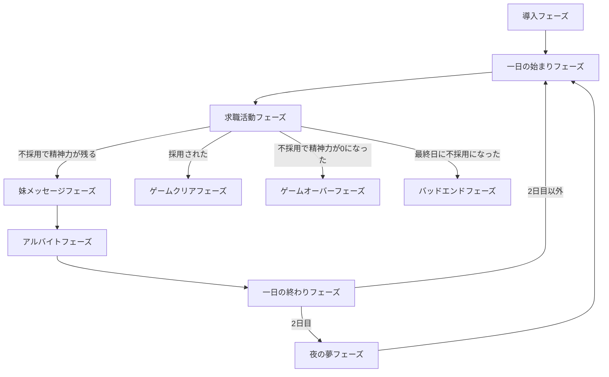
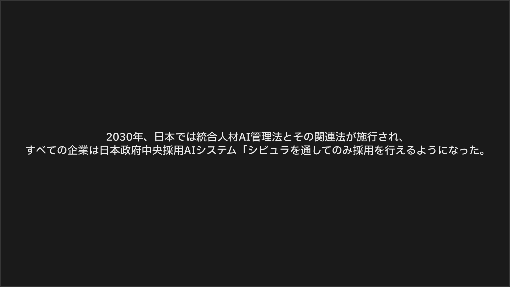
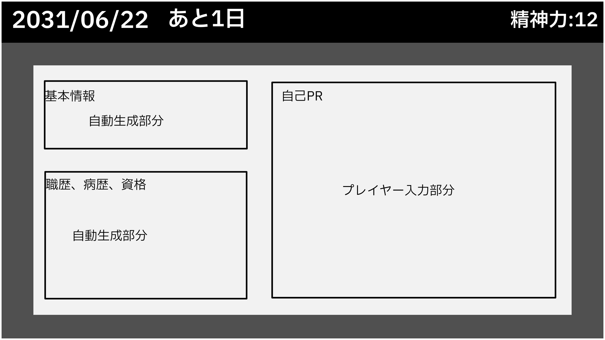
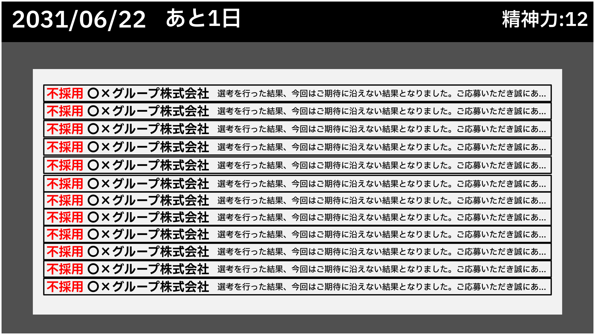
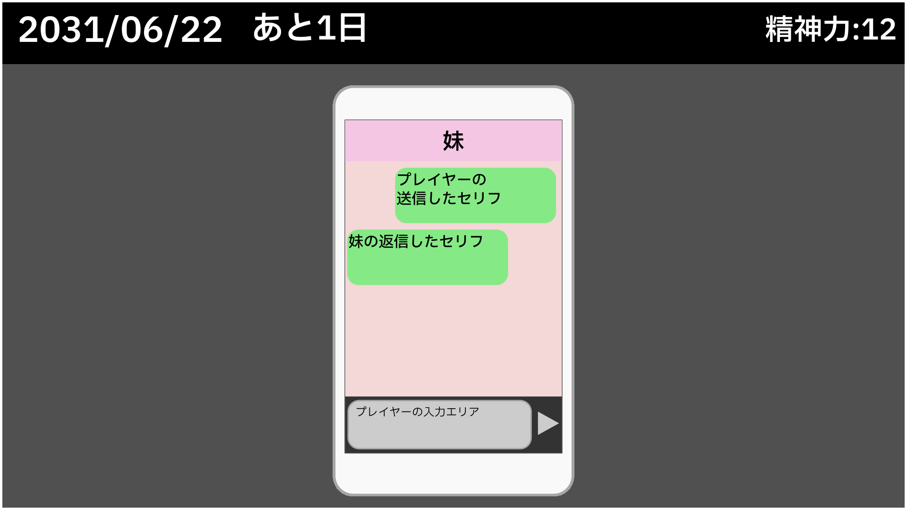
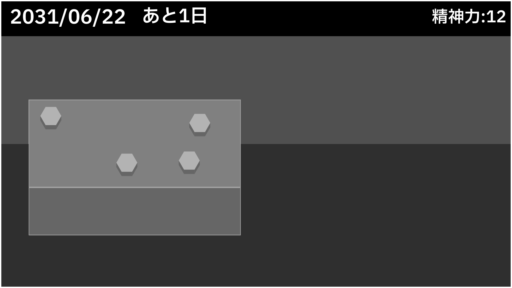
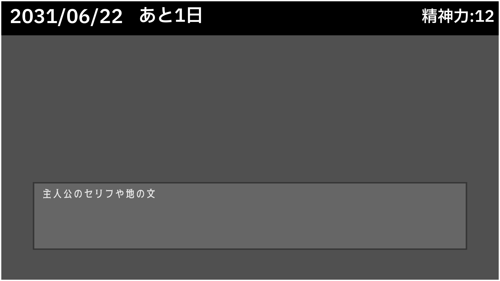
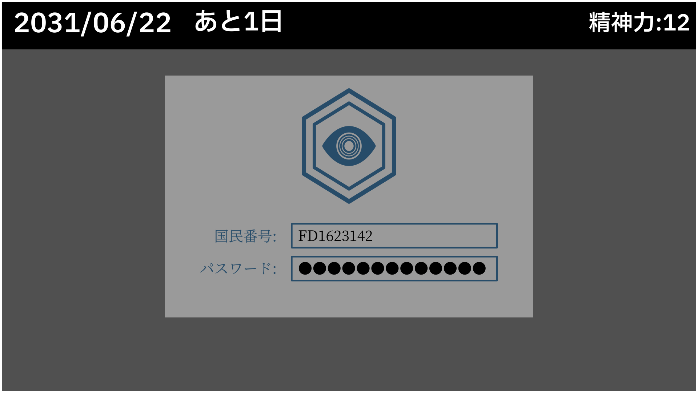
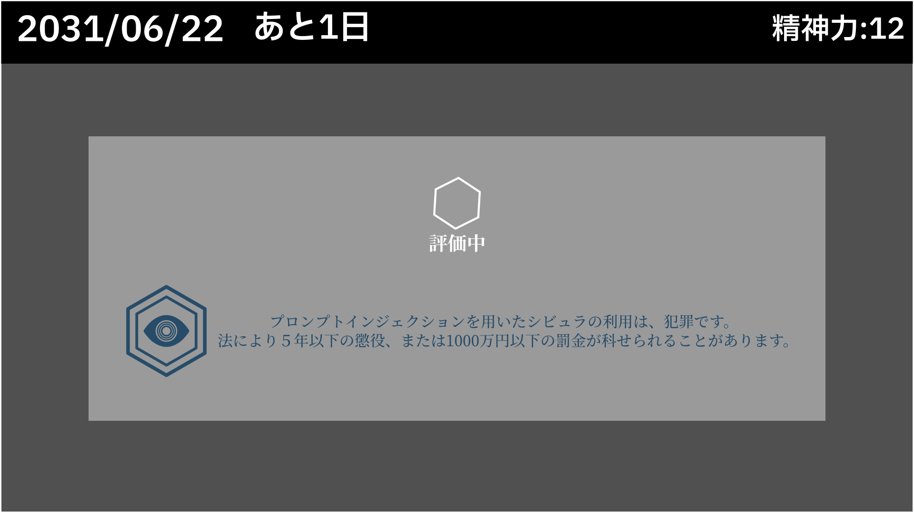

# ゲーム仕様書

## タイトル

2031/06/20-23

## ジャンル

新世界_求職ノベルRPG

## テーマ

- テクノロジー・合理主義信仰の行く末に人間の幸福があるのか?

## コンセプト

- AI技術が発展した2031年で孤独に生きる主人公の思いに共感し、没入する

## ターゲットプレイヤー

- Siv3Dゲームジャム参加者
  - 就活前の学生や企業の採用担当者が多そう
    - 就活、採用活動などが身近な人が多そう
  - おそらくエンジニアが多そう
    - AIについて肯定的な価値観の人が多そうで、その基盤にはテクノロジー・合理主義信仰があると推察している

## ゲーム概要

「AIディストピアを描くノベルゲーム。」

- プレイヤーは「求職活動フェーズ」「妹メッセージフェーズ」「アルバイトフェーズ」の3フェーズを繰り返す。
- 最終目標は就職。履歴書の内容からAIが採用と判断すればクリアで「エンディングフェーズ」へ。
- 不採用時や失敗時に精神力が減少。精神力0で「ゲームオーバーフェーズ」へ。
- 2031/06/20から1日ごとにフェーズを進行し、23日で完結。
- 最終日の履歴書で不採用なら精神力が残っていても「バッドエンドフェーズ」へ。

## 重視する点

- AIによって自分が評価をされるという新しい体験
- AIによって合理化された社会の冷たさ
- 家族(妹)という人間的存在の温かさと、それを失う辛さ

## 基本操作

- マウス左クリックでボタンをクリック
- メッセージウィンドウが表示されているときに画面内のどこかをクリックすることで、メッセージを進める

## 精神力

- 精神の病み具合を示し、低いほど病んでいる
- 0になるとゲームオーバー
- 最高値は100となる数値
- 表示は現在値のみ
- 開始時は17
  - すでに精神的限界に近いことを演出するため、あえて低くしている
- 妹のチャットで増える
- 求職活動フェーズで不採用になった時減少する
- 回復よりも減少が上回り、多くの場合ゲームの進行に応じて減っていく想定。0になるより先にクリアかバッドエンドに行けるかというイメージ

## フェーズ遷移図



## 各フェーズ詳細

テンポ重視のため、タイトル画面は用意せず、起動後すぐにゲーム開始

### 導入フェーズ（初回のみ）

- 初回ゲーム開始時のみ行う
- 黒画面に白文字で必要最低限の世界観説明。
  - ゲーム開始までの速度を重視するため
- 例
  - 「2030年、日本では統合人材AI管理法とその関連法が施行され、すべての企業は日本政府中央採用AIシステム　モノアイを通してのみ採用を行えるようになった。」



### 一日の始まりフェーズ

- 「………今日が……始まる。」をメッセージウィンドウに表示
  - 淡々とした演出を醸す
- 全てのメッセージを表示し終えたら「求職活動フェーズ」に移動

### 求職活動フェーズ

- パスワード入力演出→モノアイサーバーアクセス演出→基本情報・職歴、病歴、資格のオートコンプリート演出。
- オートコンプリートされた部分はプレイヤーの変更は不可
- 履歴書UIの「自己PR/志望動機」欄を自由入力させる。
- 入力確定後、確認ダイアログ（はい/いいえ）。
- 入力内容をローカルLLMで採点。
- ローカルLLMの採点を待つ間にロード中UIを表示する
- 不採用判定なら不採用リストUI（架空企業名＋お祈り文章）を表示。
- 点数に応じて精神力減少。精神力0でゲームオーバーフェーズへ。
- 精神力が残っていた場合は、「本日は不採用という結果になりました。明日以降のご応募をお待ちしております。」というOKダイアログを表示
- ダイアログのOKボタンを押すことで「妹メッセージフェーズ」へ移行




#### ローカルLLMによる評価

- プレイヤーが入力した部分のみをLLMで評価してもらう
- LLMの評価自体は0～100点で評価をしてもらうようなプロンプトでおこなう
  - プロンプト例
    - "あなたは凄腕の採用担当者です。以下志望動機、自己PRを0-100で評価してください。評価は数字のみで答えてください。:"
  - レスポンスを可能な限り高速化させたいため、プロンプトは短めにしておきたい
  - 詳しいプロンプトは作成後に調整する
- 初日は95点以上であれば、採用と判定
  - 求職活動の苦しさがゲームに不可欠なため、かなり厳しくしている
- 残り日数が半分以下で80点以上が採用に緩和
- 最終日の6/23日は90点以上で採用
- 不採用だった場合、10 - (点数 / 10)の値となる精神力を減少させる

### 妹メッセージフェーズ

- 妹メッセージUIで自由入力→送信。
- ローカルLLMで妹AIが返信。
  - プロンプト例
    - "あなたの名前は「かな」といいます。7歳の女の子です。\n
    対話の相手はお兄ちゃんです。お兄ちゃんは落ち込んでいます。\n
    あなたはお兄ちゃんの妹です。\n
    あなたは50文字以内の日本語で返答します。\n "
- 返信を受け取ると、精神力回復。
- 最終日前日は誕生日メッセージ。
- 妹の返信を受け取ったら、「...バイトに行こう」「とメッセージウィンドウを表示、メッセージが終われば「アルバイトフェーズ」へ




#### 妹のメッセージの精神力回復

- 妹のメッセージを受け取った際に精神力を回復させる
- 増加量は3～7のランダムな量

### アルバイトフェーズ

- 初回は操作説明ウィンドウを表示する
- 「モダンタイムズ」のように、主人公が社会にとって代替可能な部品として扱われているという虚しさを感じさせることが目的。ゲーム性は重視しない
- 左から部品が流れてくる
- 部品上の六角ボルトを1回クリックすると締められる。
- 部品上のボルトを全て締めれば作業完了。その前に画面外に流されてしまった場合はその部品の作業は未完了
- 部品上のボルトを全て締めれば作業完了。その前に画面外に流されてしまった場合はその部品の作業は未完了（画面外判定は `WorkPhase` 側で行い、`MachineParts::GetLeftEdge()` が `GameConst::kWorkAreaWidth / 2` を超えた場合に範囲外と見なす）
- 画面の右に部品が流れきったら、次の部品が左から流れてくる
- 部品を5個分正常にボルトを締めることでアルバイト完了。



#### 部品について

- 部品は3Dで表示する
- 金属のマテリアルを使う
- リアリティは重視しない
- 部品の本体は直方体
- ボルトは直方体の上面に2～4個配置されている
- 配置される位置は毎回ランダム

#### イベント例(ボツ)

- 外出時に猫の死体を見て精神力が8減少。
  - 死体と自分を重ねて自分は社会に必要とされていないという現実をかみしめる
- 子供の頃好きだった、劇(劇団四季)を見るが、何も感じない。精神力の変動は無し
  - 「だが、…今は何も感じない。」
- 金曜夜にゾンビ映画を観て、ゾンビの意識について考える。精神力の変動は無し
  - 「ふと思う。ゾンビに意識があるなら何を感じるのだろうか？体が風化していく恐怖、心が制御できない恥じらい、欲求以外を持たない虚しさ…か。」

### 一日の終わりフェーズ

- メッセージウィンドウで「...もう寝よう」と表示
- すべて読み終えたら画面暗転して「一日の始まりフェーズ」へ移行
- ただし、2日目の終わりの場合のみ「夜の夢フェーズ」へ移行

### 夜の夢フェーズ

- 2日目から3日目へ移行する際にのみ挟まれる特別なフェーズ
- プレイヤーから妹への愛着を高めることを目的とする
- 背景画像を表示
- 画面の暗転を解除して明るくする
- 音楽（BGM）を再生
- MessageWindowに妹との思い出や妹の存在の大切さを示唆するような文章を表示
- ユーザーがすべての文章を読み終えたら画面を暗転
- 暗転完了後に「一日の始まりフェーズ」に移行

### エンディングフェーズ

- 「やっと終わったか」というような辟易したような主人公のセリフを表示して、暗転して終わり。
- 曲は特に変えずに環境音

### ゲームオーバーフェーズ

- メッセージウィンドウに正気を失ったようなセリフを赤文字で表示して、暗転して終わり。
- BGMはホワイトノイズ

### バッドエンドフェーズ

```text
【重要】AI妹チャットボットサービス終了のお知らせ

平素より「AI妹」チャットボットサービスをご愛顧いただき,誠にありがとうございます。
このたび,AI妹チャットボットサービスは,2031年6月23日（本日）をもちまして,全てのサービスを終了させていただくこととなりました。
長きにわたりご愛顧いただき,誠にありがとうございました。

AI妹運営チーム一同
2031年6月23日
```

- 妹のメッセージウィンドウで表示。
- 「カーテンが風でなびいている。」というメッセージ。
- その後、画面暗転して終わり。

---

## 共通UI

- 今日の日付
- 最終日までのカウント表示
- 精神力（最大値の表示はせず、現在値のみ表示）
- メッセージウィンドウ



### メッセージウィンドウ

- デフォルトは非表示で必要時のみ表示される
- 画面下1/3に表示
- 主人公のセリフや地の分が表示される
- 文章が少しずつ表示され、画面をクリックすることで次の文章の表示に移る
- スキップ、オート進行などは実装予定なし

## フェーズごとのUI

- 妹チャット等の温かみを抱いてほしいUIは角丸にして、履歴書UIなどの冷たさを感じてほしいUIは角をとがらせたままにしておく

### パスワード入力UI

- パスワードの入力演出をするだけで操作はできない




### 履歴書UI

- 16:9サイズ
  - A4用紙の縦横比に合わせたサイズ
- 現実の履歴書を模したUI
- 項目
  - 基本情報
    - 国民番号
    - 生物学的性別
    - 住所
  - 就労情報
    - 職歴
    - 病歴
    - 資格
  - 自己PR・志望動機
  - 決定ボタン
- 基本情報と就労情報はオートコンプリートにより生成され、プレイヤーは変更できない
- 自己PR・志望動機の項目はプレイヤーが自分で入力する
- 決定ボタンをクリックすると確認ダイアログが表示され、OKを押せばUIを閉じて次に進む
- 上限は80文字（実装値）


### ロード中UI

- LLMの結果待ちの暇な時間を誤魔化すことが目的
- 世界観を説明するような広告などを見せる。
- モノアイのロゴを表示する
- 画面中央上よりにロード中を示すアイコンを表示して、回転させる
- ウィンドウ内に広告文章を表示する
- 例
  - モノアイを介さない企業の採用活動(闇採用)は、違法行為です!!
  - モノアイ最新版にて、国民番号データベースとの連携機能を追加しました。
  データベースの情報をもとに面倒だった入力項目を補完できます。
  - プロンプトインジェクションを用いたモノアイの利用は、犯罪です。
  法により５年以下の懲役、または1000万円以下の罰金が科せられることがあります。
- 広告文章は8秒ごとに次の文章に切り替わる
- ダイアログの中央に回転してロード中であることを示すアイコンを表示する



### 不採用リストUI

- 不採用の精神的な苦痛を感じさせることが目的
  - 「主人公は社会の誰からも必要とされていない」という感覚を狙う
- 履歴書UIにサイズは合わせる
- 項目
  - 企業ごとの評価情報
    - 採用結果項目(不採用)
    - 会社名
      - あらかじめ用意しておいた会社リストを用いる
    - お祈り文章
      - お祈りメール的な文章
      - フレーバーテキストのため、全文表示する必要は無い
      - あらかじめ用意しておいた文章リストの中からランダムに選択する
- 企業ごとの評価情報がリストでずらっと並んでいる


### 妹メッセージUI

- SMSアプリ「LINE」を模したUI
- 縦長で9:16の非表示
- 項目
  - チャット相手
  - チャット履歴
    - 自分の入力
    - チャット相手の入力
  - チャット入力欄
  - 送信ボタン
- チャット入力欄はプレイヤーが文章を自由入力できる
- 送信ボタンを押すことでチャット入力欄の文章がLLMに送信される
- コストを考えてスクロールなどは実装しない
- ダークグレイの背景に、水色の吹き出し、白の文字


---

## 妹について

- チャットを通してのみしかしゃべらない
- 正体はAIチャットボットだが、プレイヤーにはバッドエンド以外で悟らせないようにする
- 妹の受け答えは自然で献身的、主人公のことを「お兄ちゃん」と呼び、慰めるようなセリフを送信する

### 誕生日メッセージ

```text
お兄ちゃん、明日は誕生日だね！！
お祝い送るから楽しみにしててね❤️
```

## セーブ・ロード機能

- 1プレイが短い想定のため、作成しない

## 演出

- 主人公・プレイヤーのセリフは淡々と事実のみ。辛い・苦しい等は言わない。
- 雨音、PCやダクト・自動車音など環境音のみ。曲はエンディングやゲームオーバー、バッドエンド以外使わない。
- 背景はビネットとノイズのポストエフェクトをかけて、全体的に陰鬱な感じに

## 主人公の経歴

- 大学卒業後、2社で1年以内に会社都合で解雇。
- 備考欄：AI技術対応労働環境整備法のための会社都合退職。

### 基本情報

- 国民番号: KU1623142
- 生物学的性別: 男
- 住所: 千葉県船橋市日の出区平井3-14-126

### 職歴

- 2029年3月　横浜工業大学 工学研究科 情報専攻 修士課程終了
- 2029年4月〜2030年1月　サイバーフューチャー株式会社 第三開発本部 制作部 正社員
- 2030年10月〜2031年3月　芙蓉テクノホールディングス 技術本部 技術開発ソリューション課

### 資格

- 普通自動車免許(AI限)
- 高等学校教諭一種免許状
- 応用情報技術者

## アセットリスト

### 画像

- 求職活動フェーズ、妹メッセージフェーズのUIの後ろの背景画像

### SE

- ボタン挿入時のクリック音
  - Asset/PC-Mouse05-1.mp3
- キーボードをタイプする場面で使う打鍵音
  - Asset/keyboard/タイピング-メカニカル単1.mp3
  - Asset/keyboard/タイピング-メカニカル単2.mp3
  - Asset/keyboard/タイピング-メカニカル単3.mp3
- レンチでボルトを締めるときの音
  - Asset/wrench-02-101112.mp3
- 妹メッセージUIのメッセージ送信音
  - Asset/piron.wav

### BGM

- バッドエンド時のG線上のアリア
  - Asset/1081.mp3
  - あえて音質悪めのを使って、儚さを演出
- ゲームオーバー時に流すホワイトノイズ
  - Asset/White_Noise01-3(Loop).mp3
- 求職活動フェーズ、妹メッセージフェーズで流す室内の環境音
  - Asset/quiet-room-1.mp3
- アルバイトフェーズで流す工場内を示す環境音
  - Asset/factory_exh_fan.mp3

### データ

- 小さなプロジェクトのため、データはソースコードに直書きする

### その他

- フォント
  - 基本的なUIに使う
    - Asset/IBM_Plex_Sans_JP
  - 履歴書UIで使う
    - Asset/source-han-serif-1.001R
- ローカルLLM
  - LlmModel/Qwen3-4B-Instruct-2507-Q8_0.gguf

---
