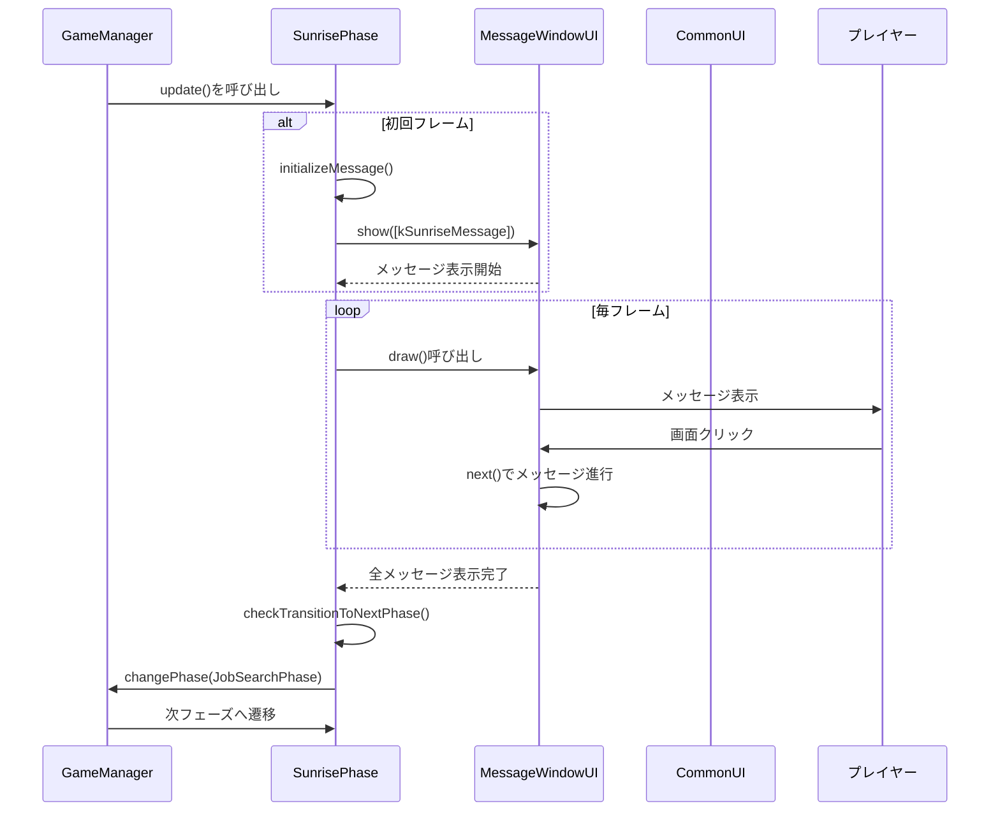
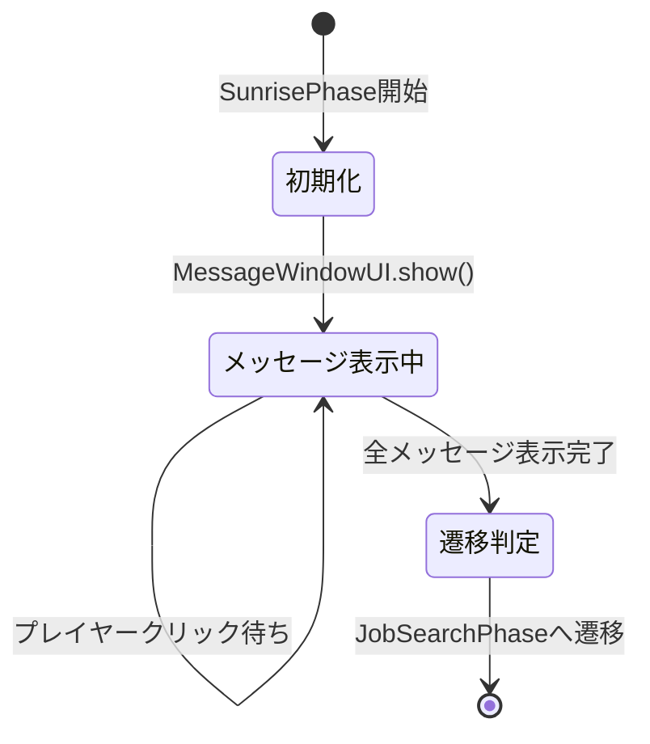

# SunrisePhase設計書

## 概要

一日の始まりを演出するフェーズクラス。メッセージウィンドウに「...今日が......始まる」という淡々とした演出を表示し、次の求職活動フェーズへ遷移する。1日目(kMusicDay=1)には追加で「気分転換に曲をかけよう」メッセージを表示し、BGMを切り替える特別処理を行う。BlackOutUIで完全にフェードアウト後に処理を開始し、MessageWindowUIによるメッセージ表示完了を待って次フェーズへ遷移する。

## 目的・スコープ

- ゲーム内の1日の開始を演出する
- 淡々とした日常の繰り返しを表現する
- 1日目のみBGM切り替えの特別処理を実施（気分転換演出）
- メッセージ表示後、自動的に求職活動フェーズ(JobSearchPhase)へ遷移する
- 他のフェーズ（SunsetPhase等）から遷移されてくる受け皿となる
- 表示用メッセージの初期化と、表示完了後のフェーズ遷移のみを担当する。UI の描画や MessageWindow の更新は `GameManager` 側で行われるため、`SunrisePhase` は主に状態制御（表示開始フラグ等）を行う
- 範囲外：メッセージの文字表示ロジック、BGM の詳細管理、背景画像のロード等は各ユーティリティ／UI に委譲する

## ほかのクラスとの関係

- `iPhase` - このクラスの基底クラス。update()とdraw()をオーバーライドする
- `MessageWindowUI` - メッセージウィンドウの表示と進行を制御するために使用。Show()で配列メッセージを渡し、IsVisible()で表示完了を判定
- `PhaseManager` - フェーズ遷移時にChangePhase(PhaseType::JobSearch)を呼び出す
- `GameCommonData` - GetCurrentDay()で現在の日付を取得し、1日目判定に使用
- `BackGroundManager` - SetBackGround(U"my_room")で背景を設定
- `SoundManager` - PlayBGM(U"bgm_room")またはPlayBGM(U"bgm_room_music")でBGMを再生
- `BlackOutUI` - IsHidden()でフェードアウト完了を確認してからメッセージ表示開始
- `MouseEffectManager` - SetActiveSound(false)でマウスエフェクト音を無効化

## このクラスが継承するクラス

`iPhase`を継承する

## このクラスのコンストラクタ

- `SunrisePhase()` - BackGroundManager::SetBackGround(U"my_room")で背景設定、SoundManager::PlayBGM(U"bgm_room")でBGM再生、MouseEffectManager::SetActiveSound(false)でマウスエフェクト音無効化を行う

## このクラスのデストラクタ

デフォルトデストラクタを使用

## このクラスに含まれるデータメンバ

- `bool hasShownMessage_` - メッセージの表示を開始したかどうかを示すフラグ（初期値false）
- `bool hasCheckedFirstDay_` - 1日目チェックを完了したかどうかを示すフラグ（初期値false）
- `bool hasShownAdditionalMessage_` - 1日目の追加メッセージを表示したかどうかを示すフラグ（初期値false）
- `bool isMessageCompleted_` - メッセージウィンドウの表示が完了したかどうかを示すフラグ（初期値false）

## このクラスに含まれる定数

- `static inline const Array<String> kSunriseMessage` - 一日の始まりに表示するメッセージ文字列の配列。要素数2: "...", "...今日が......始まる"
- `static inline const Array<String> kFirstDayAdditionalMessage` - 1日目に追加で表示するメッセージ配列。要素数2: "...", "気分転換に曲をかけよう"
- `static constexpr int kMusicDay = 1` - 曲をかける日（1日目を示す定数）

## このクラスに含まれるpublicメソッド

- `void update() override` - 毎フレーム呼ばれる更新処理。BlackOutUI::IsHidden()がtrueになったら最初のメッセージ表示を開始。最初のメッセージ表示完了後、1日目ならBGM切り替え付き追加メッセージを表示。全メッセージ表示完了後に次のフェーズへ遷移
- `void draw() const override` - 毎フレーム呼ばれる描画処理。CommonUIとMessageWindowUIの描画はGameManagerで実行されるため、ここでは何もしない

## このクラスに含まれるprivateメソッド

- `void initializeMessage()` - メッセージウィンドウに表示する内容を初期化する内部処理。MessageWindowUI::Show(kSunriseMessage)を呼び出し、hasShownMessage_をtrueに設定
- `void showFirstDayAdditionalMessage()` - 1日目の追加メッセージを表示する内部処理。MessageWindowUI::Show(kFirstDayAdditionalMessage)を呼び出し、hasShownAdditionalMessage_をtrueに設定。SoundManager::PlayBGM(U"bgm_room_music")でBGMを切り替え
- `void checkTransitionToNextPhase()` - メッセージ表示完了後、次のフェーズへの遷移をチェックする処理。hasShownMessage_とhasCheckedFirstDay_がtrueで、まだ遷移していない場合、isMessageCompleted_をtrueにしてPhaseManager::ChangePhase(PhaseType::JobSearch)を呼び出す

## このクラスで参照するアセットの情報

- 特になし（メッセージウィンドウや共通UIが使用するフォント、BGMなどは各UIクラス側で管理）

## このクラスが参照する仕様書の項目

- 一日の始まりフェーズ
- 共通UI
- メッセージウィンドウ

## このクラスが使用されるフェーズ

- 一日の始まりフェーズ

## 特記事項・メモ

- このフェーズは非常にシンプルで、メッセージを1つ表示して次のフェーズに遷移するのみ
- プレイヤーの操作は画面クリックによるメッセージ送りのみ
- MessageWindowUI::isShowing()がfalseになったタイミングで次のフェーズ（JobSearchPhase）へ遷移する
- 淡々とした演出を重視するため、特別なエフェクトや演出は不要

## シーケンス図

## 状態遷移図

