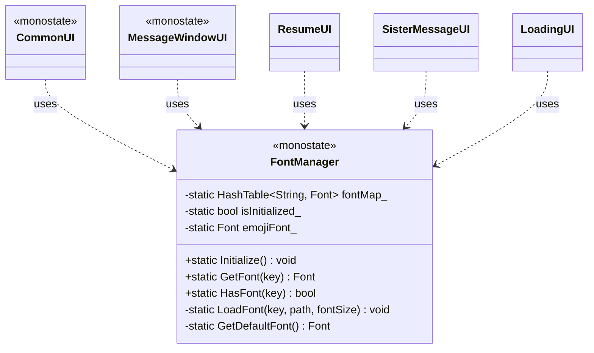

# FontManager設計書

## 概要

ゲーム内で使用する全てのフォントを一元管理するユーティリティクラス。キー文字列を通じてフォントオブジェクトへのアクセスを提供し、フォントリソースの読み込みと管理を担当する。

## 目的・スコープ

このクラスは、ゲーム全体で使用されるフォントリソースの管理を目的としており、以下の責務を持つ:

- フォントアセットの初期化時一括読み込み
- キー文字列によるフォントオブジェクトの取得インターフェース提供
- フォントリソースのライフサイクル管理

モノステートパターンで実装され、ゲームのどの部分からでもアクセス可能。個別のフォント描画処理や文字列レンダリングは対象外。

## ほかのクラスとの関係

- `CommonUI` - 共通UI要素の描画時にフォントを取得する
- `MessageWindowUI` - メッセージウィンドウのテキスト描画時にフォントを取得する
- `ResumeUI` - 履歴書UIの各項目描画時にフォントを取得する
- `SisterMessageUI` - チャットメッセージ表示時にフォントを取得する
- `LoadingUI` - ロード中広告テキスト表示時にフォントを取得する
- その他すべてのUI系クラス - テキスト描画が必要な際にフォントを取得する

## このクラスが継承するクラス

なし（モノステートパターンによる静的クラスとして実装）

## このクラスのコンストラクタ

デフォルトコンストラクタのみ。モノステートパターンのため、インスタンス生成は不要。

## このクラスのデストラクタ

デフォルトデストラクタのみ。静的メンバの破棄はプログラム終了時に自動的に行われる。

## このクラスに含まれるデータメンバ

- `static inline HashTable<String, Font> fontMap_` - フォント名をキーとして`Font`オブジェクトを保持するハッシュテーブル
- `static inline bool isInitialized_` - 初期化済みフラグ（初期値false）。二重初期化を防ぐ
- `static inline std::unique_ptr emojiFont_` - 絵文字用フォント（フォールバック用）。スマートポインタで遅延初期化（E200エラー回避）

## このクラスに含まれる定数

- `static constexpr int32 kDefaultFontSize = 24` - デフォルトのフォントサイズ(ピクセル)
- `static constexpr int32 kSmallFontSize = 18` - 小さいフォントサイズ(ピクセル)
- `static constexpr int32 kMediumFontSize = 24` - 中サイズフォントサイズ(ピクセル)
- `static constexpr int32 kLargeFontSize = 32` - 大きいフォントサイズ(ピクセル)
- `static inline const FilePath kIBMPlexSansPath = U"Asset/IBM_Plex_Sans_JP/IBMPlexSansJP-Regular.ttf"` - IBM Plex Sans JPフォントファイルパス
- `static inline const FilePath kSourceHanSerifPath = U"Asset/source-han-serif-1.001R/SourceHanSerif-Medium.otf"` - Source Han Serifフォントファイルパス

## このクラスに含まれるpublicメソッド

- `static void Initialize()` - フォントの初期化処理。ゲーム起動時に一度だけ呼び出す。絵文字用フォントを初期化し、全てのフォントアセットを読み込んでハッシュテーブルに登録する
- `[[nodiscard]] static const Font& GetFont(const String& key)` - 指定されたキー文字列に対応するフォントオブジェクトの参照を返す。キーが存在しない場合はデフォルトフォントを返す
- `[[nodiscard]] static bool HasFont(const String& key) noexcept` - 指定されたキーのフォントが登録されているかを確認する

## このクラスに含まれるprivateメソッド

- `static void LoadFont(const String& key, const FilePath& path, int32 fontSize)` - 指定されたパスからフォントを読み込み、絵文字フォントをフォールバックとして追加し、キーと共にハッシュテーブルに登録する
- `static Font& GetDefaultFont()` - デフォルトフォントの参照を返す内部処理。フォント取得時のフォールバック用。絵文字フォントをフォールバックとして追加する

## このクラスで参照するアセットの情報

- `Asset/IBM_Plex_Sans_JP/IBMPlexSansJP-Regular.ttf` - 基本的なUI要素に使用するフォント
- `Asset/source-han-serif-1.001R/SourceHanSerif-Medium.otf` - 履歴書UIなど公式文書風の場面で使用するフォント

## このクラスが参照する仕様書の項目

- 共通UI
- メッセージウィンドウ
- 履歴書UI
- 妹メッセージUI
- 不採用リストUI
- ロード中ダイアログ

## このクラスが使用されるフェーズ

全フェーズで使用される（ユーティリティクラスのため）

## 特記事項・メモ

- モノステートパターンで実装するため、静的メンバのみで構成される
- `Initialize()`は`GameManager`のコンストラクタで呼び出される（FontManager::Initialize()とSoundManager::Initialize()はGameManagerのコンストラクタで一括初期化）
- フォントキーは以下を想定:
  - `"default"` - デフォルトフォント (IBM Plex Sans JP、24px)
  - `"ui_small"` - 小さいUIテキスト用 (IBM Plex Sans JP、18px)
  - `"ui_medium"` - 中サイズUIテキスト用 (IBM Plex Sans JP、24px)
  - `"ui_large"` - 大きいUIテキスト用 (IBM Plex Sans JP、32px)
  - `"resume_small"` - 履歴書小テキスト用 (Source Han Serif、18px)
  - `"resume_medium"` - 履歴書中テキスト用 (Source Han Serif、24px)
  - `"resume_large"` - 履歴書大テキスト用 (Source Han Serif、32px)
- フォント読み込み失敗時はSiv3Dのデフォルトフォントをフォールバックとして使用
- 絵文字フォント（Typeface::ColorEmoji）を全フォントのフォールバックとして設定し、絵文字表示をサポート
- ヘッダーファイルはUTF-8 with BOM形式で保存する（C4819警告回避）

## クラス図

