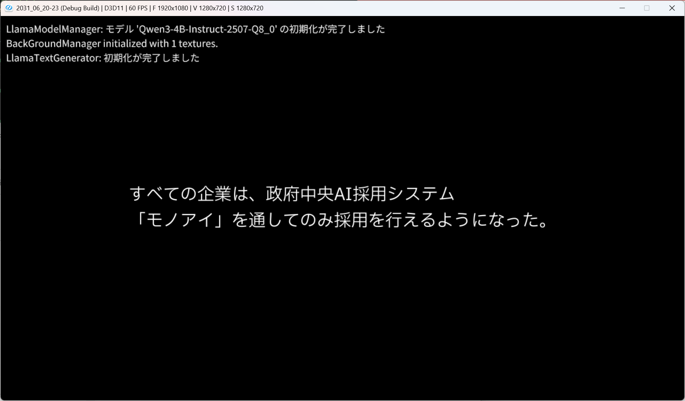
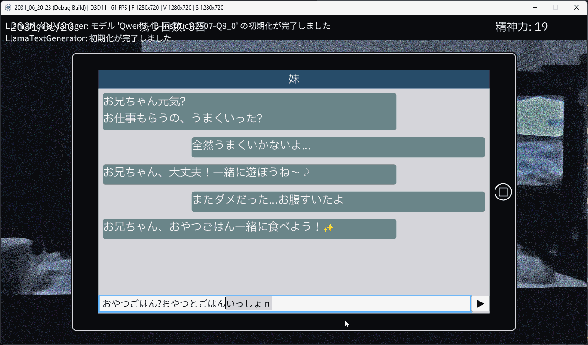
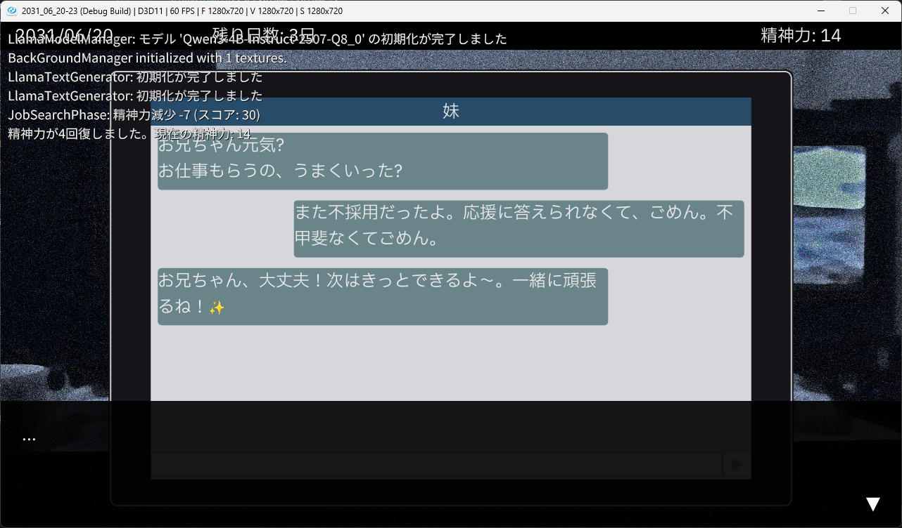
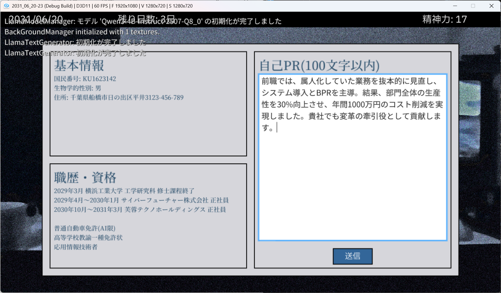
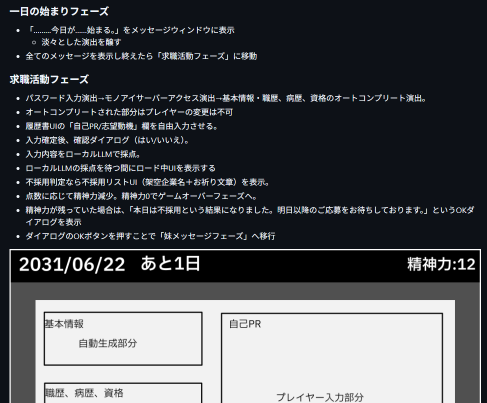
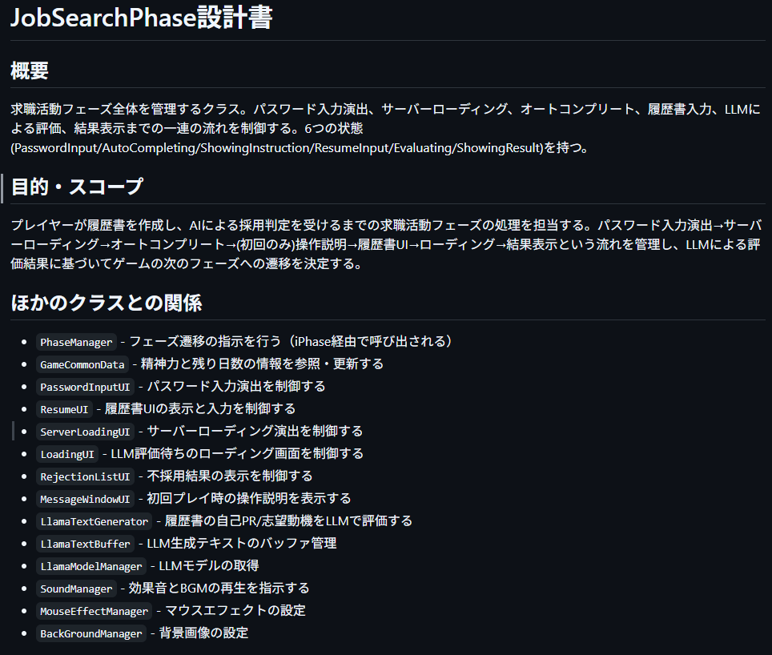

<!-- このMarkDownはMarpを用いたこのゲーム(docs/game_spec.md)の発表スライド資料です -->

# 2031/06/20-23
<!-- 12s -->
- ジャンル: 新世界_求職ノベルRPG
- ゲームを一言で:未来の世界(2031/6)で4日間、求職活動をする
---

<!--
90秒に収めるためカット

## ゲームについて:世界観

---

-->

## ゲームについて:ゲームプレイの構成、体験
- 求職活動(自己PR作成)→妹とコミュニケーション→アルバイトを日単位で繰り返す（6/20〜6/23）
- AIに自分(プレイヤー自身)が評価されるという新しい体験
- 2031年の求職生活に没入できる

 

---

<!--
90秒に収めるためカット

## 工夫点:ローカルLLMの活用
- 用途: 履歴書の自己PR採点、妹チャットの返信生成
- ローカルモデル: `LlmModel/Qwen3-4B-Instruct-2507-Q8_0.gguf` を使用
- 利用ライブラリ:llama.cppを使用
- 効果:AIでなければできない体験を作れた、クラウドLLMのようにAPI使用料がかからなかった

 

---

-->

## 工夫点:Spec駆動・AI駆動開発
<!-- 18s -->
- やったこと:仕様書→全体設計書→クラス設計書→ソースコードの順で作成/生成
- 効果: コーディングの **70～80%** をAIに任せられて、だいぶ労力が削減

 

---

## 感想:Spec駆動・AI駆動開発
<!-- 12s -->
- 仕様書や画像、設計書テンプレートを使うことで、だいぶAIで生成するソースコードのコントールが取れそう
- レビューやチェックをAIエージェントでやれるようになれば、  
**仕様書から動作可能なコード生成までをAIで並列実行できる** ようになる
-  **2031年にはコーディングもAIが中心かも**

---

## おわり

- AI周りのことはCosenseの作品紹介ページに詳しく書いたので、興味があればご覧ください